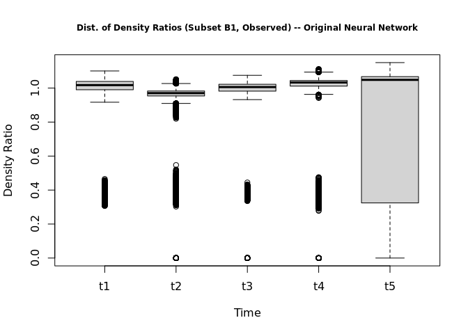
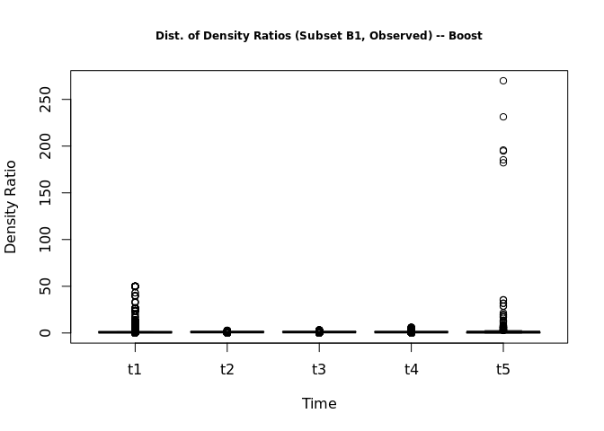

Distributions of Density Ratios (Original Neural Network and Boosting)
================
2024-11-21

## Original Neural Network

### Observed (B1)

<!-- -->

    ## [[1]]
    ##    Min. 1st Qu.  Median    Mean 3rd Qu.    Max. 
    ##  0.3061  0.9902  1.0174  0.9824  1.0392  1.1009 
    ## 
    ## [[2]]
    ##    Min. 1st Qu.  Median    Mean 3rd Qu.    Max. 
    ##  0.0000  0.9536  0.9704  0.8837  0.9829  1.0523 
    ## 
    ## [[3]]
    ##    Min. 1st Qu.  Median    Mean 3rd Qu.    Max. 
    ##  0.0000  0.9820  1.0060  0.8625  1.0223  1.0752 
    ## 
    ## [[4]]
    ##    Min. 1st Qu.  Median    Mean 3rd Qu.    Max. 
    ##  0.0000  1.0116  1.0329  0.8297  1.0446  1.1123 
    ## 
    ## [[5]]
    ##    Min. 1st Qu.  Median    Mean 3rd Qu.    Max. 
    ##  0.0000  0.3244  1.0484  0.7831  1.0674  1.1500

### Observed (B2)

<!-- -->

    ## [[1]]
    ##    Min. 1st Qu.  Median    Mean 3rd Qu.    Max. 
    ##  0.2871  0.9961  1.0106  0.9766  1.0243  1.1016 
    ## 
    ## [[2]]
    ##    Min. 1st Qu.  Median    Mean 3rd Qu.    Max. 
    ##  0.0000  1.0184  1.0280  0.9349  1.0354  1.0938 
    ## 
    ## [[3]]
    ##    Min. 1st Qu.  Median    Mean 3rd Qu.    Max. 
    ##  0.0000  0.9630  0.9785  0.8440  1.0019  1.0980 
    ## 
    ## [[4]]
    ##    Min. 1st Qu.  Median    Mean 3rd Qu.    Max. 
    ##  0.0000  0.9633  1.0004  0.8091  1.0309  1.1009 
    ## 
    ## [[5]]
    ##    Min. 1st Qu.  Median    Mean 3rd Qu.    Max. 
    ##  0.0000  0.3247  1.0382  0.7745  1.0517  1.1275

### Observed (B3)

<!-- -->

    ## [[1]]
    ##    Min. 1st Qu.  Median    Mean 3rd Qu.    Max. 
    ##  0.3175  0.9887  1.0130  0.9821  1.0422  1.1193 
    ## 
    ## [[2]]
    ##    Min. 1st Qu.  Median    Mean 3rd Qu.    Max. 
    ##  0.0000  0.9505  0.9587  0.9075  1.0131  1.1016 
    ## 
    ## [[3]]
    ##    Min. 1st Qu.  Median    Mean 3rd Qu.    Max. 
    ##  0.0000  0.9769  0.9904  0.8541  1.0093  1.1226 
    ## 
    ## [[4]]
    ##    Min. 1st Qu.  Median    Mean 3rd Qu.    Max. 
    ##  0.0000  0.9585  1.0119  0.8121  1.0308  1.1164 
    ## 
    ## [[5]]
    ##    Min. 1st Qu.  Median    Mean 3rd Qu.    Max. 
    ##  0.0000  0.3409  1.0230  0.7826  1.0804  1.1614

### d1 (B1)

<!-- -->

    ## [[1]]
    ##    Min. 1st Qu.  Median    Mean 3rd Qu.    Max. 
    ## 0.01627 0.70136 0.95492 1.00521 1.27974 2.13961 
    ## 
    ## [[2]]
    ##    Min. 1st Qu.  Median    Mean 3rd Qu.    Max. 
    ##  0.0000  0.6279  0.8900  0.9458  1.2745  2.2290 
    ## 
    ## [[3]]
    ##    Min. 1st Qu.  Median    Mean 3rd Qu.    Max. 
    ##  0.0000  0.6110  0.8564  0.9095  1.2680  2.6253 
    ## 
    ## [[4]]
    ##    Min. 1st Qu.  Median    Mean 3rd Qu.    Max. 
    ##  0.0000  0.5278  0.8625  0.8823  1.2853  2.2726 
    ## 
    ## [[5]]
    ##    Min. 1st Qu.  Median    Mean 3rd Qu.    Max. 
    ##  0.0000  0.3046  0.8113  0.7922  1.2118  2.3647

### d2 (B2)

<!-- -->

    ## [[1]]
    ##    Min. 1st Qu.  Median    Mean 3rd Qu.    Max. 
    ##  0.3490  0.8030  0.8876  1.0352  1.1417  2.2912 
    ## 
    ## [[2]]
    ##    Min. 1st Qu.  Median    Mean 3rd Qu.    Max. 
    ##  0.0000  0.8001  0.8744  0.9736  1.1169  2.3261 
    ## 
    ## [[3]]
    ##    Min. 1st Qu.  Median    Mean 3rd Qu.    Max. 
    ##  0.0000  0.8375  0.9479  0.9879  1.1711  2.7025 
    ## 
    ## [[4]]
    ##    Min. 1st Qu.  Median    Mean 3rd Qu.    Max. 
    ##  0.0000  0.7983  0.9126  0.9075  1.1380  2.4986 
    ## 
    ## [[5]]
    ##    Min. 1st Qu.  Median    Mean 3rd Qu.    Max. 
    ##  0.0000  0.3114  0.9709  0.8747  1.1614  2.5562

### d3 (B3)

<!-- -->

    ## [[1]]
    ##     Min.  1st Qu.   Median     Mean  3rd Qu.     Max. 
    ## 0.001521 0.938361 0.962304 0.957960 0.962507 1.775612 
    ## 
    ## [[2]]
    ##    Min. 1st Qu.  Median    Mean 3rd Qu.    Max. 
    ##  0.0000  0.5812  0.9253  0.9294  1.2624  2.1839 
    ## 
    ## [[3]]
    ##    Min. 1st Qu.  Median    Mean 3rd Qu.    Max. 
    ##  0.0000  0.5589  0.8813  0.8940  1.2521  2.4200 
    ## 
    ## [[4]]
    ##    Min. 1st Qu.  Median    Mean 3rd Qu.    Max. 
    ##  0.0000  0.5107  0.7992  0.8216  1.1479  2.3167 
    ## 
    ## [[5]]
    ##    Min. 1st Qu.  Median    Mean 3rd Qu.    Max. 
    ##  0.0000  0.2174  0.7357  0.7425  1.1049  2.3821

## Boosting

### Observed (B1)

<!-- -->

    ## [[1]]
    ##    Min. 1st Qu.  Median    Mean 3rd Qu.    Max. 
    ##  0.0000  0.7881  0.7990  0.8687  1.0079 50.0164 
    ## 
    ## [[2]]
    ##    Min. 1st Qu.  Median    Mean 3rd Qu.    Max. 
    ##  0.0000  1.0157  1.0220  0.9128  1.0260  2.8575 
    ## 
    ## [[3]]
    ##    Min. 1st Qu.  Median    Mean 3rd Qu.    Max. 
    ##  0.0000  1.0179  1.0238  0.8608  1.0297  3.3691 
    ## 
    ## [[4]]
    ##    Min. 1st Qu.  Median    Mean 3rd Qu.    Max. 
    ##  0.0000  0.9683  0.9779  0.7866  1.0249  6.1923 
    ## 
    ## [[5]]
    ##      Min.   1st Qu.    Median      Mean   3rd Qu.      Max. 
    ##   0.00000   0.00087   1.02815   0.75800   1.03664 269.90707

### Observed (B2)

<!-- -->

    ## [[1]]
    ##    Min. 1st Qu.  Median    Mean 3rd Qu.    Max. 
    ##  0.0000  0.8298  0.8397  0.8915  1.0176 94.7337 
    ## 
    ## [[2]]
    ##    Min. 1st Qu.  Median    Mean 3rd Qu.    Max. 
    ##  0.0000  1.0166  1.0234  0.9145  1.0281  3.7274 
    ## 
    ## [[3]]
    ##    Min. 1st Qu.  Median    Mean 3rd Qu.    Max. 
    ##   0.000   1.017   1.023   0.860   1.029   3.348 
    ## 
    ## [[4]]
    ##    Min. 1st Qu.  Median    Mean 3rd Qu.    Max. 
    ##  0.0000  0.9674  0.9779  0.7873  1.0260  6.5108 
    ## 
    ## [[5]]
    ##     Min.  1st Qu.   Median     Mean  3rd Qu.     Max. 
    ##   0.0000   0.0002   1.0304   0.7634   1.0391 405.9306

### Observed (B3)

<!-- -->

    ## [[1]]
    ##     Min.  1st Qu.   Median     Mean  3rd Qu.     Max. 
    ##   0.0000   0.8300   0.9018   0.9425   1.0093 377.5813 
    ## 
    ## [[2]]
    ##    Min. 1st Qu.  Median    Mean 3rd Qu.    Max. 
    ##  0.0000  0.8323  0.8398  0.8300  1.0232  5.3445 
    ## 
    ## [[3]]
    ##    Min. 1st Qu.  Median    Mean 3rd Qu.    Max. 
    ##  0.0000  1.0177  1.0233  0.8601  1.0294  3.2511 
    ## 
    ## [[4]]
    ##    Min. 1st Qu.  Median    Mean 3rd Qu.    Max. 
    ##  0.0000  0.9624  0.9718  0.7852  1.0263  6.7798 
    ## 
    ## [[5]]
    ##     Min.  1st Qu.   Median     Mean  3rd Qu.     Max. 
    ##   0.0000   0.0000   1.0302   0.7629   1.0391 323.4781

### d1 (B1)

<!-- -->

    ## [[1]]
    ##    Min. 1st Qu.  Median    Mean 3rd Qu.    Max. 
    ##   0.000   1.189   1.869   2.844   3.426 991.304 
    ## 
    ## [[2]]
    ##      Min.   1st Qu.    Median      Mean   3rd Qu.      Max. 
    ##    0.0000    0.1685    0.1692    0.3932    0.3337 1026.4983 
    ## 
    ## [[3]]
    ##     Min.  1st Qu.   Median     Mean  3rd Qu.     Max. 
    ##   0.0000   0.0940   0.1235   0.2358   0.1758 567.0924 
    ## 
    ## [[4]]
    ##      Min.   1st Qu.    Median      Mean   3rd Qu.      Max. 
    ##    0.0000    0.3498    0.4634    1.0351    0.5372 1847.5725 
    ## 
    ## [[5]]
    ##      Min.   1st Qu.    Median      Mean   3rd Qu.      Max. 
    ##    0.0000    0.1505    0.1505    0.5557    0.2774 1073.5709

### d2 (B2)

<!-- -->

    ## [[1]]
    ##     Min.  1st Qu.   Median     Mean  3rd Qu.     Max. 
    ##   0.0000   0.4945   1.6555   1.6921   2.1700 160.5589 
    ## 
    ## [[2]]
    ##      Min.   1st Qu.    Median      Mean   3rd Qu.      Max. 
    ##    0.0000    0.4232    0.6715    1.1662    1.0778 1911.8918 
    ## 
    ## [[3]]
    ##     Min.  1st Qu.   Median     Mean  3rd Qu.     Max. 
    ##   0.0000   0.2839   0.4314   1.2405   0.8548 905.1914 
    ## 
    ## [[4]]
    ##      Min.   1st Qu.    Median      Mean   3rd Qu.      Max. 
    ##    0.0000    0.0020    0.1474    2.4145    1.0058 2005.9969 
    ## 
    ## [[5]]
    ##     Min.  1st Qu.   Median     Mean  3rd Qu.     Max. 
    ##    0.000    0.151    0.234    4.089    1.111 6147.390

### d3 (B3)

<!-- -->

    ## [[1]]
    ##    Min. 1st Qu.  Median    Mean 3rd Qu.    Max. 
    ##   0.000   1.756   5.413  11.348  14.880 501.712 
    ## 
    ## [[2]]
    ##      Min.   1st Qu.    Median      Mean   3rd Qu.      Max. 
    ##     0.000     0.113     0.263     1.092     0.486 10492.006 
    ## 
    ## [[3]]
    ##      Min.   1st Qu.    Median      Mean   3rd Qu.      Max. 
    ##    0.0000    0.2944    0.3859    0.6628    0.5026 1212.1475 
    ## 
    ## [[4]]
    ##     Min.  1st Qu.   Median     Mean  3rd Qu.     Max. 
    ##    0.000    0.133    0.230    0.582    0.593 5658.296 
    ## 
    ## [[5]]
    ##     Min.  1st Qu.   Median     Mean  3rd Qu.     Max. 
    ##      0.0      0.0      0.0     15.3      0.3 494607.8
